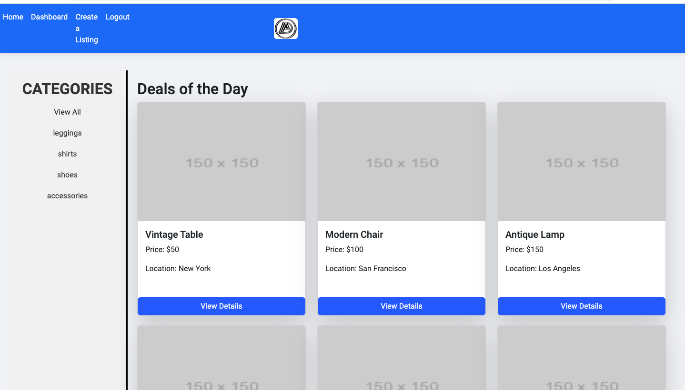

# Deal Dive (Project-2)

## Description

This is an alternative market app where users can quickly and casually sell items on their own merits mostly focusing in fashion. Users can inspect listings, compare to listings on Amazon and create ones themselves in different categories. 🧥 👖 🥾

In addition there is a login system so that a user can create an account and then create their listings via a form in which a URL image can be used. (suggestion Imgur)

## Table of Contents

- [Description](#Decription)
- [Usage](#Usage)
- [Credits](#Credits)
- [License](#License)
- [Deployment](#Deployment)

## Usage

Video demo: https://drive.google.com/file/d/1Lw7hVGXrJzksF6ou2Bc_r4Wg8cv3-mL-/view

Users must first source schema, seeds, and query sql files and fill out a sign up segment then click the index.js

On the site, users must create an account in order to make a listing on the site. Enter a username, email and password and then select sign in. 

From there the users can select create a listing and fill out a form. To add an image it must have a URL.

## Credits

@lcurtis0 @SediaM @samt11345 @kojootchere 

Credit to Fireship for explaining RxJS and Mulitcast : https://www.youtube.com/watch?v=2LCo926NFLI&ab_channel=Fireship 
Check 14:00

Credit to RxJS documentation for explaining RxJS Observables : https://rxjs.dev/guide/overview

## License

## Deployment
Evaluated environment url: https://samt11345.github.io/Deal-Dive/

Heroku Deployed url: https://deal-dive-dcc6c738ad30.herokuapp.com/

